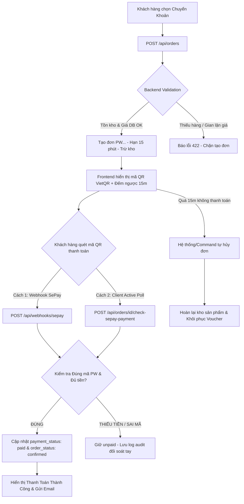

# BẢNG KIỂM THỬ TOÀN DIỆN CHỨC NĂNG THANH TOÁN ONLINE (SEPAY / VIETQR) - PETWORLD

Bảng kịch bản kiểm thử chi tiết bao phủ toàn bộ các trường hợp có thể xảy ra trong luồng **Thanh toán Online / Chuyển khoản ngân hàng tự động qua SePay & VietQR** tại PetWorld.

---

## 1. BẢNG KỊCH BẢN KIỂM THỬ CHI TIẾT (23 TRƯỜNG HỢP)

| STT | Phân loại | Kịch bản kiểm thử | Dữ liệu & Thao tác kiểm thử | Kết quả mong đợi | Kết quả thực tế (Hiện tại) | Trạng thái |
| :---: | :--- | :--- | :--- | :--- | :--- | :---: |
| **1** | **Đặt hàng & Sinh QR** | **Khách chọn thanh toán Chuyển khoản thành công** | Chọn phương thức *"Chuyển khoản qua ngân hàng"*, điền địa chỉ và bấm *"Đặt hàng"*. | - Đơn hàng được tạo ở trạng thái `order_status: pending`, `payment_status: unpaid`. - Sinh mã thanh toán `PW{id}` duy nhất. - Trừ tồn kho biến thể. - Đơn gán hạn `expires_at` là 15 phút. | Hệ thống khởi tạo đơn hàng thành công, cấp mã `PW{id}` duy nhất, trừ tồn kho an toàn và gán hạn hết hạn sau 15 phút. | **Đạt** |
| **2** | **Đặt hàng & Sinh QR** | **Bảo mật tính lại giá tiền từ Database** | Client cố tình can thiệp request POST `/api/orders` sửa tổng tiền hoặc đơn giá sản phẩm thành 0đ hoặc 1.000đ. | Backend hoàn toàn bỏ qua giá phía Client gửi lên, tự query DB khóa bản ghi và tính lại chính xác tổng tiền. | Backend dùng `effectivePrice()` từ DB để tính toán lại tổng đơn hàng, loại bỏ nguy cơ gian lận giá từ Client. | **Đạt** |
| **3** | **Đặt hàng & Sinh QR** | **Tạo và hiển thị mã QR VietQR động** | Sau khi đặt hàng thành công, quan sát mã QR hiển thị trên màn hình Checkout. | QR chứa chính xác: Ngân hàng (MBBank), Số tài khoản, Chủ tài khoản, Số tiền chính xác và Nội dung chuyển khoản `PW{id}`. | Hàm `buildSepayQrUrl` dựng đúng link VietQR với thông số ngân hàng, số tiền và mã đơn hàng `PW...` | **Đạt** |
| **4** | **Đặt hàng & Sinh QR** | **Khách hàng không đủ hàng trong kho** | Số lượng mua vượt quá số lượng tồn kho khả dụng của biến thể sản phẩm. | Backend chặn tạo đơn hàng và trả về thông báo lỗi 422: *"Sản phẩm X chỉ còn Y trong kho"*. | Backend khóa bản ghi `lockForUpdate` kiểm tra tồn kho, từ chối tạo đơn nếu vượt quá tồn kho. | **Đạt** |
| **5** | **Đặt hàng & Sinh QR** | **Áp dụng Voucher khi thanh toán Online** | Đặt đơn chuyển khoản kèm theo mã giảm giá Voucher hợp lệ. | Giá trị giảm giá `discount_amount` được trừ trực tiếp vào tổng tiền chuyển khoản trên mã QR. | Mã QR sinh ra tự động khớp số tiền sau khi đã trừ bớt số tiền giảm giá từ Voucher. | **Đạt** |
| **6** | **Thanh toán thành công** | **Khách quét QR / Chuyển khoản ĐÚNG số tiền & ĐÚNG nội dung (Webhook)** | Khách chuyển đúng số tiền đơn hàng và nội dung `PW{id}`. SePay gửi Webhook về `/api/webhooks/sepay`. | - Webhook trả về 200 OK. - `payment_status` đổi thành `paid`. - `order_status` đổi thành `confirmed`. - Lưu vết log vào `sepay_transactions`. | Webhook nhận diện regex mã `PW...`, đối soát đúng số tiền và tự động cập nhật đơn thành Đã thanh toán & Đã xác nhận. | **Đạt** |
| **7** | **Thanh toán thành công** | **Chủ động đối soát qua SePay API (Client Polling)** | Môi trường Local không nhận được Webhook public. Client gọi API `check-sepay-payment` mỗi 4 giây. | Backend dùng `SEPAY_API_TOKEN` gọi API SePay tra cứu giao dịch khớp mã `PW...`, nếu tìm thấy sẽ xác nhận thanh toán ngay. | Class `SepayPaymentReconciler` tìm thấy giao dịch chuyển khoản khớp mã và chuyển đơn sang `paid` ngay cả khi không có Webhook. | **Đạt** |
| **8** | **Thanh toán thành công** | **Chuyển khoản THỪA tiền** | Đơn hàng 200.000đ nhưng khách cố tình hoặc vô ý chuyển 250.000đ với nội dung `PW{id}`. | Số tiền chuyển `>= total_amount`, hệ thống vẫn xác nhận đơn hàng thành công (`paid` & `confirmed`) và ghi log số tiền thực nhận. | Backend chấp nhận giao dịch khi `transferAmount >= total_amount`, cập nhật thanh toán thành công và lưu log 250.000đ để audit. | **Đạt** |
| **9** | **Xử lý sự cố thanh toán** | **Chuyển khoản THIẾU tiền** | Đơn hàng 200.000đ nhưng khách chỉ chuyển 150.000đ với nội dung `PW{id}`. | - Đơn hàng giữ nguyên `payment_status: unpaid`. - Hệ thống vẫn ghi nhận log giao dịch vào DB để Admin kiểm tra và xử lý thủ công. | Webhook kiểm tra `amount < total_amount`, giữ đơn ở trạng thái `unpaid` và lưu lịch sử giao dịch thiếu tiền vào `sepay_transactions`. | **Đạt** |
| **10** | **Xử lý sự cố thanh toán** | **Chuyển khoản SAINỘI DUNG (Không có mã PW...)** | Khách chuyển tiền đúng số tài khoản và đúng số tiền nhưng ghi nội dung *"Nguyen Van A chuyen tien"*. | Webhook/API không tìm thấy mã đơn `PW...`, không thể tự động gán vào đơn. Ghi log giao dịch mồ côi (`order_id = null`) để đối soát tay. | Hệ thống lưu log giao dịch mồ côi kèm đầy đủ số tài khoản, số tiền và nội dung để Admin tra cứu trong trang quản trị. | **Đạt** |
| **11** | **Xử lý sự cố thanh toán** | **Chống thanh toán trùng lặp (Webhook Idempotency)** | SePay gửi lại cùng một giao dịch (trùng `id` SePay) 2 hay nhiều lần. | Hệ thống nhận biết `sepay_id` đã tồn tại trong DB, trả về thông báo *"Giao dịch đã được xử lý"* và không cập nhật trùng. | Backend kiểm tra `SepayTransaction::where('sepay_id', $sepayId)->exists()`, ngăn chặn xử lý lại giao dịch đã ghi nhận. | **Đạt** |
| **12** | **Quản lý thời gian & Hết hạn** | **Đồng hồ đếm ngược 15 phút trên giao diện** | Khách hàng ở lại màn hình hướng dẫn thanh toán QR Code. | Đồng hồ đếm ngược từ 15:00 về 00:00 dựa trên mốc thời gian `expires_at` của server. | React Hook tính toán chính xác số giây còn lại (`paymentExpiresAt - Date.now()`) và cập nhật đồng hồ mỗi giây. | **Đạt** |
| **13** | **Quản lý thời gian & Hết hạn** | **Mã QR hết hạn 15 phút (Giao diện Client)** | Để quá 15 phút không thanh toán trên giao diện. | Ẩn mã QR, hiển thị màn hình thông báo *"Mã QR đã hết hạn sau 15 phút"* kèm nút *"Tạo lại mã QR"*. | Giao diện tự động phát hiện `qrExpired`, ẩn mã QR cũ và cung cấp nút bấm gia hạn tiện lợi cho khách hàng. | **Đạt** |
| **14** | **Quản lý thời gian & Hết hạn** | **Khách hàng bấm "Tạo lại mã QR" (Gia hạn QR)** | Bấm nút *"Tạo lại mã QR"* khi mã cũ sắp hoặc đã hết hạn (đơn vẫn ở `pending`). | Gọi API `/api/orders/{id}/renew-payment`, gia hạn mốc `expires_at` thêm 15 phút từ thời điểm bấm. Mã đơn `PW{id}` giữ nguyên. | API đẩy lùi mốc `expires_at`, đồng hồ trên giao diện tự reset về 15 phút để khách tiếp tục quét mã. | **Đạt** |
| **15** | **Quản lý thời gian & Hết hạn** | **Hệ thống tự động hủy đơn quá hạn & Hoàn kho** | Đơn hàng quá 15 phút chưa được thanh toán và bị quét bởi Command/Schedule tự hủy. | - `order_status` đổi thành `cancelled`. - Tự động hoàn lại số lượng tồn kho sản phẩm. - Phục hồi trạng thái Voucher (nếu có). | Hàm `restockAndMarkCancelled()` chạy an toàn trong Transaction, hoàn trả tồn kho sản phẩm và đánh dấu đơn đã hủy. | **Đạt** |
| **16** | **Quản lý thời gian & Hết hạn** | **Tiền chuyển đến SAU KHI đơn đã bị hủy** | Khách chuyển khoản quá muộn sau khi đơn hàng đã bị hệ thống tự động hủy. | Webhook từ chối cập nhật `paid` cho đơn đã hủy (`order_status != pending`), giữ nguyên trạng thái hủy để tránh loạn kho. Ghi log để hoàn tiền. | Webhook lọc chỉ tìm đơn `order_status: pending`, giao dịch chuyển muộn được ghi log dưới dạng giao dịch cần đối soát hoàn tiền. | **Đạt** |
| **17** | **Khách hàng Hủy đơn** | **Khách hàng bấm "Hủy đơn" khi CHƯA thanh toán** | Vào *"Theo dõi đơn hàng"*, bấm nút *"Hủy đơn"* khi đơn đang ở trạng thái `pending` & `unpaid`. | - Hủy đơn thành công. - Hoàn lại kho sản phẩm. - Gửi email thông báo hủy đơn cho khách hàng. | Backend xử lý hủy đơn, gọi `restockAndMarkCancelled()`, gửi `OrderStatusMail` và trả về kết quả hủy thành công. | **Đạt** |
| **18** | **Khách hàng Hủy đơn** | **Cố gắng Hủy đơn SAU KHI ĐÃ thanh toán thành công** | Cố tình gọi API hủy đơn hoặc thao tác hủy khi đơn đã ở trạng thái `paid`. | Backend từ chối hủy đơn và báo lỗi 409: *"Đơn hàng đã thanh toán không thể tự hủy. Vui lòng liên hệ PetWorld"*. | Backend kiểm tra `payment_status === 'paid'`, chặn hành động tự hủy để bảo vệ doanh thu và quyền lợi khách hàng. | **Đạt** |
| **19** | **Khách hàng Hủy đơn** | **Cố gắng Hủy đơn khi đơn ĐANG GIAO hoặc ĐÃ GIAO** | Cố tình gửi request hủy đơn khi `order_status` là `shipping` hoặc `completed`. | Backend từ chối hủy đơn và báo lỗi 409: *"Chỉ có thể hủy đơn hàng đang chờ xác nhận"*. | Backend chỉ cho phép hủy khi `order_status === 'pending'`, loại bỏ việc hủy đơn bất hợp lệ khi hàng đã xuất kho. | **Đạt** |
| **20** | **Trải nghiệm & Ngoại lệ** | **Tải lại trang (F5) / Mất kết nối khi đang chờ thanh toán** | Khách hàng bấm F5 hoặc đóng trình duyệt mở lại trong lúc đơn chuyển khoản chưa thanh toán. | Trang Checkout đọc `localStorage` khôi phục lại màn hình QR Code và đếm ngược mà không làm mất đơn. | `readPendingPayment()` khôi phục snapshot đơn hàng, kiểm tra lại trạng thái thực tế từ Server để hiển thị đúng màn hình. | **Đạt** |
| **21** | **Trải nghiệm & Ngoại lệ** | **Sao chép thông tin chuyển khoản (Copy Clipboard)** | Bấm nút *"Sao chép"* mã đơn hàng, số tài khoản, số tiền hoặc nội dung chuyển khoản. | Sao chép chính xác văn bản vào Clipboard và hiển thị phản hồi trực quan (VD: *"Đã sao chép"*). | Khách hàng dễ dàng sao chép thông tin sang ứng dụng ngân hàng mà không sợ gõ sai số tiền hay mã đơn. | **Đạt** |
| **22** | **Bảo mật Webhook** | **Kiểm tra tính hợp lệ của Webhook Request** | Giả lập request gửi tới `/api/webhooks/sepay` không có Header Authorization hoặc sai API Key. | Server chặn ngay lập tức và trả về HTTP 401 Unauthorized, không thay đổi bất kỳ dữ liệu nào. | Webhook Controller kiểm tra `$request->header('Authorization') === 'Apikey '.$expectedKey`, chặn tuyệt đối các request giả mạo. | **Đạt** |
| **23** | **Thông báo hệ thống** | **Gửi Email xác nhận tự động** | Đặt đơn hàng thành công hoặc Thanh toán thành công. | Gửi email thông báo chi tiết đơn hàng đến Email khách hàng và Email Admin cửa hàng. | Hệ thống sử dụng Laravel Mail (`OrderConfirmationMail`) gửi thông báo email tức thì qua SMTP Gmail. | **Đạt** |

---

## 2. TỔNG KẾT VỀ MẶT KỸ THUẬT VÀ KIẾN TRÚC

### Các ưu điểm nổi bật của hệ thống thanh toán PetWorld:
1. **Tính linh hoạt cao:** Hoạt động hoàn hảo cả trên môi trường **Production** (qua Webhook SePay đẩy về) lẫn môi trường **Local Development** (qua cơ chế Client Active Polling API).
2. **An toàn dữ liệu tuyệt đối:** Sử dụng cơ chế khóa hàng DB `lockForUpdate` và Database Transaction cho mọi thao tác trừ kho, hoàn kho và cập nhật thanh toán.
3. **Trải nghiệm người dùng mượt mà:** Mã QR tự động điền sẵn nội dung, đếm ngược chính xác, hỗ trợ khôi phục phiên khi F5 hoặc rớt mạng.
